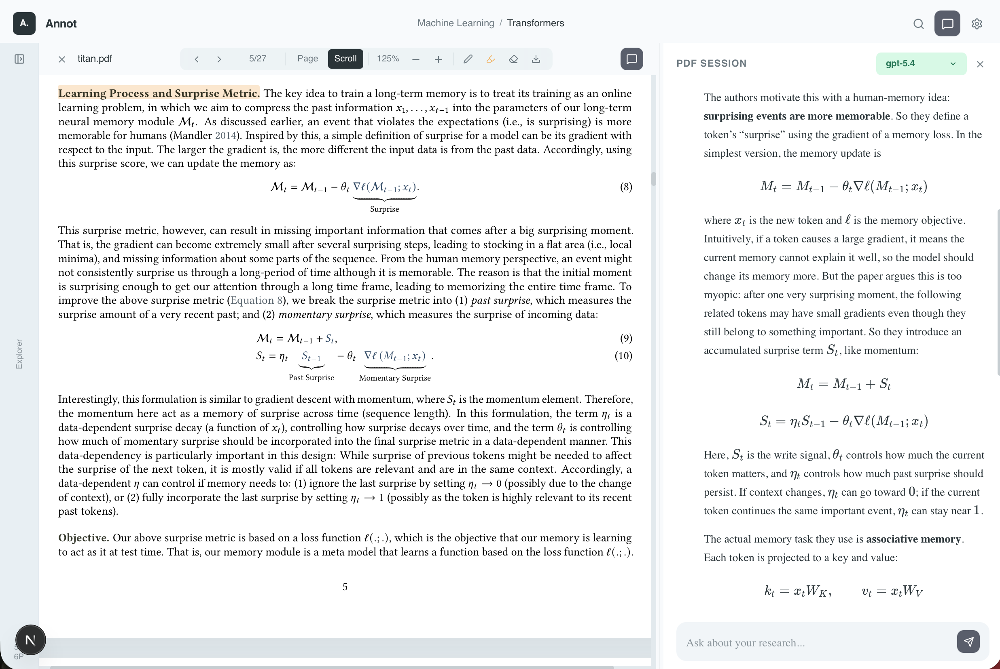

# Annot

Annot is a local-first PDF reading workspace with a built-in Codex chat panel.

It is designed for a simple loop:

1. organize papers in folders
2. open a PDF and read it in place
3. highlight and annotate while you read
4. ask questions in a chat session tied to that folder or PDF

Annot uses your existing local Codex login on the same machine. No `OPENAI_API_KEY` setup is required.

## Screenshots

### PDF reading + chat



### Settings


## What It Does

- Real filesystem-backed workspace rooted at `~/Annot` by default
- Folder tree with create, rename, move, and delete actions
- Real PDF rendering with vertical scroll mode and page mode
- Text selection, highlights, and eraser mode inside the PDF viewer
- Separate folder sessions and PDF-specific chat sessions
- Codex-backed chat that can continue across turns and reuse session state
- Math rendering in chat via KaTeX
- Adjustable chat font size and resizable chat panel

## Requirements

Before you start, make sure you have:

- Node.js 20+ installed
- npm installed
- Codex installed locally on this machine
- An active local Codex login

If Codex is not already signed in, open Codex first and complete login there.

## Quick Start

Install dependencies:

```bash
npm install
```

Start the development server:

```bash
npm run dev
```

Then open:

```text
http://localhost:3000
```

## First-Time Setup

If this is your first time opening Annot:

1. Go to `Settings` and confirm that `Connected via Codex` is shown.
2. Return to the workspace.
3. Create a folder in the explorer.
4. Upload one or more PDF files.
5. Open a PDF and start reading.
6. Ask your first question in the chat panel.

Annot creates its workspace under `~/Annot` by default.

If you want to use a different root directory, start the app with:

```bash
ANNOT_ROOT=/your/path npm run dev
```

## How Sessions Work

Annot has two kinds of chat sessions:

- Folder sessions: broader discussions that can span a folder and its papers
- PDF sessions: focused discussions tied to one specific PDF

This keeps paper-specific conversations from mixing with broader folder-level research threads.

## Typical Workflow

### 1. Build your workspace

Use the explorer on the left to create folders and upload PDFs.

### 2. Read in the viewer

Open a paper and read it directly in Annot. You can switch between page mode and vertical scroll mode.

### 3. Mark important passages

Select text to highlight it. Use the eraser mode to remove highlights by selecting overlapping text.

### 4. Ask context-aware questions

Use the chat panel to ask for:

- summaries
- section explanations
- equation walkthroughs
- translations
- comparisons across papers

### 5. Return later

Annot restores the right session for the current folder or PDF so you can continue where you left off.

## Notes

- Annot is designed to work with your local Codex authentication state.
- The app reads and manages files locally.
- PDF highlights currently live inside Annot rather than being written back into the original PDF file.
- The development flow is the main supported setup here:

```bash
npm run dev
```

## Tech Stack

- Next.js
- React
- Tailwind CSS
- react-pdf / pdf.js
- Codex CLI

## License

Apache-2.0. See [LICENSE](./LICENSE).
